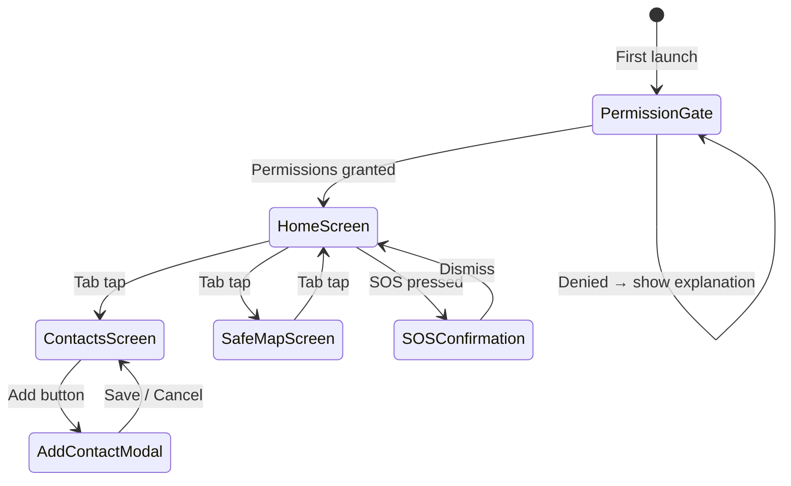

# Design Document: Women's Safety App

## Overview

A single self-contained HTML file that functions as a mobile-first progressive web application for personal safety. The app delivers four core capabilities: one-tap SOS alerting, trusted contact management, live location sharing, and a nearby safe-places map.

Because the target is a single HTML file with no build tooling, all logic lives in vanilla JavaScript, all styles in an embedded `<style>` block, and all external dependencies are loaded from CDN at runtime. Persistence is handled entirely through `localStorage`. Device capabilities (GPS, SMS, contacts) are accessed through standard browser APIs and URI schemes.

**Technology choices:**
- Leaflet.js (CDN) — interactive map rendering
- OpenStreetMap tiles — map tile layer
- Overpass API — querying nearby POIs (police stations, hospitals)
- Geolocation API — GPS coordinates
- `sms:` URI scheme / `navigator.share` — SMS dispatch
- `navigator.contacts` (Contact Picker API) — native contact import
- `localStorage` — trusted contact persistence

---

## Architecture

The app is structured as a single-page application with a tab-based navigation model. All "screens" are `<div>` panels toggled via CSS `display` — no routing library needed.

```
┌─────────────────────────────────────────────────────┐
│                   index.html                        │
│                                                     │
│  ┌──────────────────────────────────────────────┐   │
│  │              App Shell (HTML)                │   │
│  │  ┌──────────┐ ┌──────────┐ ┌─────────────┐  │   │
│  │  │  Home    │ │ Contacts │ │  Safe Map   │  │   │
│  │  │  Screen  │ │  Screen  │ │   Screen    │  │   │
│  │  └──────────┘ └──────────┘ └─────────────┘  │   │
│  │         Bottom Tab Navigation Bar           │   │
│  └──────────────────────────────────────────────┘   │
│                                                     │
│  ┌──────────────────────────────────────────────┐   │
│  │           JavaScript Modules (inline)        │   │
│  │  ┌────────────┐  ┌────────────┐              │   │
│  │  │ StorageAPI │  │  GpsAPI    │              │   │
│  │  └────────────┘  └────────────┘              │   │
│  │  ┌────────────┐  ┌────────────┐              │   │
│  │  │  SmsAPI    │  │ OverpassAPI│              │   │
│  │  └────────────┘  └────────────┘              │   │
│  │  ┌────────────┐  ┌────────────┐              │   │
│  │  │ SOSManager │  │LiveTracker │              │   │
│  │  └────────────┘  └────────────┘              │   │
│  │  ┌────────────┐                              │   │
│  │  │  MapView   │                              │   │
│  │  └────────────┘                              │   │
│  └──────────────────────────────────────────────┘   │
└─────────────────────────────────────────────────────┘
```

### Screen Flow



---

## Components and Interfaces

### StorageAPI

Thin wrapper around `localStorage` for typed read/write of trusted contacts.

```js
StorageAPI = {
  getContacts()       → TrustedContact[]
  saveContacts(arr)   → void
  addContact(c)       → void | throws DuplicateError
  removeContact(id)   → void
}
```

### GpsAPI

Wraps `navigator.geolocation` with a timeout and last-known-location cache.

```js
GpsAPI = {
  lastKnown: Coordinates | null,
  getCurrentPosition(timeoutMs) → Promise<Coordinates>
  watchPosition(callback)       → watchId (number)
  clearWatch(watchId)           → void
}
```

### SmsAPI

Builds and dispatches SMS messages. On mobile browsers the `sms:` URI scheme opens the native SMS composer pre-filled with recipients and body. Falls back to `navigator.share` if available.

```js
SmsAPI = {
  sendAlert(contacts, message) → void
  buildAlertMessage(name, coords, timestamp) → string
}
```

### SOSManager

Orchestrates the SOS flow: get location → build message → send SMS → show confirmation.

```js
SOSManager = {
  trigger()  → Promise<SOSResult>
}

SOSResult = {
  timestamp: string,
  coords: Coordinates | null,
  locationStale: boolean,
  notified: TrustedContact[]
}
```

### LiveTracker

Manages the live-tracking session using `setInterval` + `GpsAPI.watchPosition`.

```js
LiveTracker = {
  isActive: boolean,
  start(contacts)  → void
  stop(contacts)   → void
}
```

### OverpassAPI

Queries the Overpass API for nearby amenities and returns normalized place objects.

```js
OverpassAPI = {
  fetchNearby(lat, lon, radiusMeters) → Promise<SafePlace[]>
}
```

### MapView

Initialises and controls the Leaflet map instance.

```js
MapView = {
  init(containerId)                → void
  setUserLocation(coords)          → void
  renderPlaces(places)             → void
  showPlaceDetail(place, userCoords) → void
}
```

---

## Data Models

### TrustedContact

```js
{
  id:    string,   // crypto.randomUUID() or Date.now().toString()
  name:  string,   // display name
  phone: string    // E.164 or local format, validated on save
}
```

Stored in `localStorage` under the key `"wsa_contacts"` as a JSON array.

### Coordinates

```js
{
  lat:       number,
  lon:       number,
  accuracy:  number,   // metres
  timestamp: number    // Unix ms
}
```

### SafePlace

```js
{
  id:       number,    // Overpass element id
  type:     "police" | "hospital",
  name:     string,
  lat:      number,
  lon:      number,
  address:  string     // tags.addr:street or fallback
}
```

### SOSResult

```js
{
  timestamp:     string,          // ISO 8601
  coords:        Coordinates | null,
  locationStale: boolean,
  notified:      TrustedContact[]
}
```

### AppState (in-memory only)

```js
{
  currentScreen:   "home" | "contacts" | "map",
  liveTracking:    boolean,
  watchId:         number | null,
  trackingInterval: number | null,
  lastSosResult:   SOSResult | null
}
```

---

## Correctness Properties

*A property is a characteristic or behavior that should hold true across all valid executions of a system — essentially, a formal statement about what the system should do. Properties serve as the bridge between human-readable specifications and machine-verifiable correctness guarantees.*


### Property 1: Alert message completeness

*For any* non-empty list of trusted contacts and any GPS coordinates, triggering SOS must produce one SMS message per contact, and each message must contain the user's name, the latitude/longitude values, and a Google Maps URL constructed from those coordinates.

**Validates: Requirements 1.3, 6.4**

### Property 2: GPS timeout fallback uses last-known location

*For any* GPS service that times out after the configured threshold (5 seconds), the alert message must include the last-known coordinates and a stale-location indicator string, rather than failing silently or omitting location data.

**Validates: Requirements 1.2, 1.5**

### Property 3: Failed-contact notification completeness

*For any* subset of trusted contacts for which SMS delivery fails, the displayed failure notification must list exactly those contacts — no more, no fewer.

**Validates: Requirements 1.6**

### Property 4: SOS confirmation screen content

*For any* completed SOS operation, the confirmation screen must display the ISO 8601 timestamp of the alert and the full list of contacts that were notified.

**Validates: Requirements 1.7**

### Property 5: Phone number validation

*For any* string submitted as a phone number, the contact manager must accept it if and only if it matches a valid international (E.164) or local phone number format, and must reject all other strings.

**Validates: Requirements 2.2**

### Property 6: Duplicate contact rejection

*For any* existing contact list, attempting to add a contact whose phone number already exists in the list must be rejected and the list must remain unchanged.

**Validates: Requirements 2.3**

### Property 7: Contact persistence round-trip

*For any* set of contacts saved through the contact manager, re-reading from localStorage must return an equivalent set with the same names and phone numbers.

**Validates: Requirements 2.1, 2.7**

### Property 8: Contact removal round-trip

*For any* contact that exists in the list, removing it must result in that contact being absent from the list, and the list must contain all other contacts unchanged.

**Validates: Requirements 2.4, 2.5**

### Property 9: Live tracking start/stop round-trip

*For any* active live-tracking session, disabling the toggle must clear the transmission interval, stop all further GPS transmissions, and send a session-ended notification to all contacts — leaving the tracker in an inactive state equivalent to its pre-start state.

**Validates: Requirements 3.2, 3.3**

### Property 10: Overpass query uses correct radius

*For any* user coordinates, the Overpass API query constructed by OverpassAPI.fetchNearby must specify a radius of exactly 5000 metres (or 10000 metres when the user opts to expand), and must request both `amenity=police` and `amenity=hospital` node types.

**Validates: Requirements 4.3**

### Property 11: Map marker category correctness

*For any* list of SafePlace objects returned by the Places_Service, each place must be rendered with a marker whose visual category indicator matches the place's `type` field (`"police"` or `"hospital"`).

**Validates: Requirements 4.4**

### Property 12: Place detail popup content

*For any* SafePlace and any user coordinates, the detail popup rendered when tapping that marker must contain the place's name, its address, and the computed straight-line distance from the user's coordinates to the place's coordinates.

**Validates: Requirements 4.5**

### Property 13: Navigation URL construction

*For any* SafePlace, tapping the detail view must open a URL of the form `https://www.google.com/maps/dir/?api=1&destination={lat},{lon}` (or equivalent geo: URI) constructed from that place's coordinates.

**Validates: Requirements 4.6**

---

## Error Handling

| Scenario | Handling |
|---|---|
| GPS unavailable on SOS | Use `GpsAPI.lastKnown`; if null, show "location unavailable" in message |
| GPS timeout (>5 s) on SOS | Send alert with `lastKnown` coords + stale flag in message body |
| No trusted contacts on SOS | Block send; show inline prompt to add a contact |
| SMS URI not supported | Fall back to `navigator.share`; if neither available, show copy-to-clipboard fallback |
| Overpass API error / timeout | Show toast "Could not load safe places. Check your connection." with retry button |
| GPS denied on map open | Show permission-explanation card with deep-link to device settings |
| Empty Overpass results (5 km) | Show "No safe places found nearby" with "Expand to 10 km" button |
| Duplicate contact submission | Inline field error: "This number is already saved" |
| Invalid phone format | Inline field error: "Enter a valid phone number" |
| localStorage quota exceeded | Catch `QuotaExceededError`; show toast "Storage full — remove unused contacts" |

All errors are surfaced in-UI (toast or inline message). No errors are silently swallowed.

---

## Testing Strategy

### Dual Testing Approach

Both unit tests and property-based tests are required. They are complementary:
- Unit tests cover specific examples, integration points, and error conditions.
- Property-based tests verify universal invariants across randomised inputs.

### Property-Based Testing

**Library:** [fast-check](https://github.com/dubzzz/fast-check) (JavaScript, browser-compatible)

Each property-based test must run a minimum of **100 iterations**.

Every test must include a comment tag in the format:
`// Feature: womens-safety-app, Property N: <property_text>`

Each correctness property from the design document maps to exactly one property-based test:

| Design Property | Test description |
|---|---|
| Property 1 | `fc.property(fc.array(contactArb), coordsArb, ...)` — verify SMS content for all contacts |
| Property 2 | `fc.property(coordsArb, ...)` — verify stale-location message on GPS timeout |
| Property 3 | `fc.property(fc.array(contactArb), fc.subarray(...), ...)` — verify failure notification lists |
| Property 4 | `fc.property(sosResultArb, ...)` — verify confirmation screen renders timestamp + contacts |
| Property 5 | `fc.property(fc.string(), ...)` — verify phone validator accepts/rejects correctly |
| Property 6 | `fc.property(fc.array(contactArb), contactArb, ...)` — verify duplicate rejection |
| Property 7 | `fc.property(fc.array(contactArb), ...)` — verify localStorage round-trip |
| Property 8 | `fc.property(fc.array(contactArb, {minLength:1}), ...)` — verify removal invariant |
| Property 9 | `fc.property(fc.array(contactArb), ...)` — verify tracker start/stop state |
| Property 10 | `fc.property(coordsArb, ...)` — verify Overpass query radius and amenity types |
| Property 11 | `fc.property(fc.array(safePlaceArb), ...)` — verify marker category matches type |
| Property 12 | `fc.property(safePlaceArb, coordsArb, ...)` — verify popup contains name, address, distance |
| Property 13 | `fc.property(safePlaceArb, ...)` — verify navigation URL format |

### Unit Tests

Unit tests focus on:
- **Specific examples**: SOS with exactly 1 contact, SOS with 3 contacts, empty contact list guard
- **Edge cases**: GPS returns null, Overpass returns empty array, phone number boundary values (`+1`, `+44...`)
- **Integration points**: `SOSManager.trigger()` end-to-end with mocked `GpsAPI` and `SmsAPI`
- **Error conditions**: localStorage `QuotaExceededError`, Overpass network failure, GPS `PERMISSION_DENIED`

### Test File Structure

```
tests/
  unit/
    storageApi.test.js
    gpsApi.test.js
    smsApi.test.js
    sosManager.test.js
    liveTracker.test.js
    overpassApi.test.js
    mapView.test.js
  property/
    contacts.property.test.js
    sos.property.test.js
    map.property.test.js
```

Tests are written with [Vitest](https://vitest.dev/) (zero-config, browser-compatible) and fast-check.
